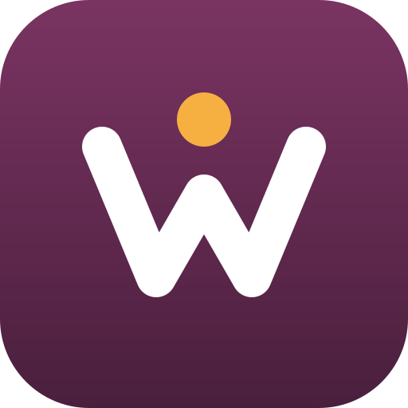

<p align="center"></p>

<h1 align="center">Winger</h1>

<p align="center"><b>A prescription and elder-care companion that never guesses a dose.</b></p>

Winger helps older people take the right medicine at the right time, and keeps their family in the loop without anyone handing their medical records to a stranger's server.

Team **AfterBurners** · CodeBlitz 2026 (ElevenLabs track)

> Winger is not medical advice. Every medicine that reaches a schedule was checked by a person.

---

## What it does

**1. Understands a prescription without betting on handwriting.** Four sources cross-check each other:

| Source | Trusted for |
|---|---|
| The doctor's own words (recorded) | *When* to take it |
| The prescription photo | Everything, when it can be read |
| The printed pharmacy bill | *What* the medicine is |
| The chemist's note | Catching a substitution at the counter |

A deterministic merge engine marks every medicine 🟢 agree, 🟡 needs a look, or 🔴 disagree. Where sources disagree, both readings are shown and a person decides. Nothing is scheduled until a person approves it.

**2. Daily doses for the person who actually takes them.** A reminder at the time, a nudge 30 minutes later, a tick per medicine and then "सब ले ली". If a dose is missed, the family is told rather than the alarm getting louder. The app is Hindi and English, body text is never below 20 pt, tap targets are never below 64 px, and every screen can be read aloud.

**3. The family sees what they need, and nobody else does** *(in progress)*:

- **Family portal:** today's doses, missed doses, the medicine list and alerts, in any browser.
- **End-to-end encrypted:** the patient's phone encrypts everything with a family code before it leaves the device. The portal decrypts in the browser. Servers only ever hold ciphertext.
- **Winger Home Vault:** an optional local server on a spare computer at home that keeps the family's records in the house, sealed again at rest.

**4. A voice companion** *(in progress)*: an ElevenLabs voice agent that calls about missed doses, checks in on how they are feeling, and helps fill in basic forms by asking simple questions.

## Repository

```
app/       Flutter app (Android + web): prescription wizard, daily doses, caregiver, voice
vault/     Winger Home Vault: Node 20, no dependencies, end-to-end encrypted family storage
backend/   Firebase relay (same API as the Vault) for the hosted demo
site/      Website and family portal
brand/     Logo
tools/     Build and agent scripts
```

## Run it

```bash
cd app
flutter pub get
flutter test
flutter run -d chrome
```

```bash
cd vault
npm test
npm start
```

The Vault prints the family-portal address for this computer and for your home Wi-Fi. Keys are never committed: ElevenLabs keys stay in your shell environment, and agent ids are passed at build time.

## Security model (Home Vault)

| | |
|---|---|
| Family code | 128-bit secret made on the patient's phone, shown as 26 characters |
| Derived with HKDF-SHA256 | household id, access token (only its SHA-256 is stored), AES-256-GCM data key |
| In transit and on any server | ciphertext only, bound to the household and record kind |
| At rest in the Vault | sealed again with the Vault's own key (random key file, or a passphrase via scrypt); file names are keyed hashes |
| Integrity | events are append-only and hash-chained; `vault verify` detects edits |
| Abuse | 10 wrong tries a minute → 429; 256 KB body cap; strict security headers |
| Ownership | the patient can erase their household at any time; encrypted single-file backups |

## Demo clinic

`site/clinic/index.html` is served at [`/clinic/`](https://wingercodeblitz.web.app/clinic/). It is **Winger Demo Clinic**, a fictional appointment-booking site and the target for demoing Winger's local browser agent ("book a doctor's appointment for grandma"). It is not a real clinic: doctors are invented, no appointment is made and no SMS is sent.

- One page, four steps: department and doctor → date and time → patient details with OTP → review and **Confirm booking**, then a confirmation with a `WDC-XXXXXX` booking ID. "My bookings" lists and cancels bookings.
- The demo OTP is always **246810**.
- Built for agents: every control has a visible label and stable `id`/`name`, errors appear as text beside the field, and the page title names the current step. Only the final button is called "Confirm booking", so the agent's safety gate can stop there.
- Nothing leaves the browser: bookings live in `localStorage`, and the only network requests are for Google Fonts.
